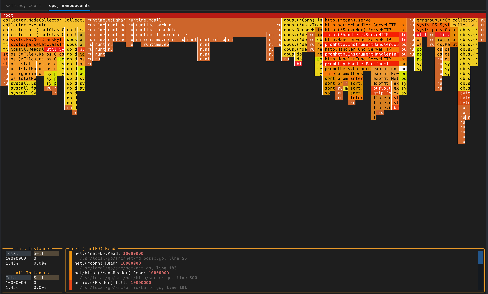

# flamegraph-textual

`flamegraph-textual` is an interactive flamegraph component for
[Textual](https://github.com/Textualize/textual).



It is the rendering library extracted from
[flameshow](https://github.com/laixintao/flameshow). Use it when you want to
embed a terminal flamegraph inside your own Textual app instead of launching a
standalone viewer.

## Install

From PyPI:

```shell
pip install flamegraph-textual
```

From a local checkout:

```shell
git clone git@github.com:laixintao/flamegraph-textual.git
cd flamegraph-textual
pip install -e .
```

For development with Poetry:

```shell
git clone git@github.com:laixintao/flamegraph-textual.git
cd flamegraph-textual
poetry install
```

## What It Does

- Renders flamegraphs as a Textual widget
- Parses profile input for you
- Supports keyboard and mouse navigation
- Supports multiple sample types when present in the profile
- Works with bundled demo data or your own files

## Quick Start

`FlameGraphView` is the main entrypoint. Pass it raw profile data and a
filename. The library parses the content internally.

```python
from pathlib import Path

from textual.app import App, ComposeResult

from flamegraph_textual import FlameGraphView


class Demo(App):
    def compose(self) -> ComposeResult:
        profile_bytes = Path("profile.out").read_bytes()
        yield FlameGraphView(profile_bytes, filename="profile.out")


Demo().run()
```

For stackcollapse text input, passing `str` also works:

```python
from pathlib import Path

from flamegraph_textual import FlameGraphView

profile_text = Path("stacks.txt").read_text(encoding="utf-8")
widget = FlameGraphView(profile_text, filename="stacks.txt")
```

## Supported Input Formats

- pprof protobuf profiles
- stackcollapse text

The parser selection is automatic through:
[parse](/Users/xintao.lai/Programs/flameshow-all/flamegraph-textual/flamegraph_textual/parsers/__init__.py)

## Try It Immediately

This repo includes sample profiles under:

- [tests/pprof_data](/Users/xintao.lai/Programs/flameshow-all/flamegraph-textual/tests/pprof_data)
- [tests/stackcollapse_data](/Users/xintao.lai/Programs/flameshow-all/flamegraph-textual/tests/stackcollapse_data)

Run the bundled examples with no setup:

```shell
python examples/pprof_binary.py
python examples/pprof_binary.py --sample goroutine
python examples/pprof_binary.py --sample heap

python examples/stackcollapse_text.py
python examples/stackcollapse_text.py --sample simple
python examples/stackcollapse_text.py --sample perf
```

You can still pass your own file path:

```shell
python examples/pprof_binary.py /path/to/profile.out
python examples/stackcollapse_text.py /path/to/stacks.txt
```

## Main API

Most users only need:

- [FlameGraphView](/Users/xintao.lai/Programs/flameshow-all/flamegraph-textual/flamegraph_textual/view.py)
- [parse](/Users/xintao.lai/Programs/flameshow-all/flamegraph-textual/flamegraph_textual/parsers/__init__.py)

Other exports are available if you want lower-level control:

- `FlameGraph`
- `FlameGraphScroll`
- `Frame`
- `Profile`
- `SampleType`

See:
[__init__.py](/Users/xintao.lai/Programs/flameshow-all/flamegraph-textual/flamegraph_textual/__init__.py)

## Controls

Inside the widget:

- `j` / `k` / `h` / `l` or arrow keys move selection
- `Enter` zooms in
- `Esc` zooms out
- `Tab` switches sample type
- `i` opens the detail screen when mounted inside a Textual app
- Mouse hover updates frame details
- Mouse click zooms into a frame

## Regenerate Protobuf Bindings

The canonical pprof schema lives in:
[profile.proto](/Users/xintao.lai/Programs/flameshow-all/flamegraph-textual/proto/profile.proto)

The generated Python module lives in:
[profile_pb2.py](/Users/xintao.lai/Programs/flameshow-all/flamegraph-textual/flamegraph_textual/parsers/profile_pb2.py)

Regenerate it with:

```shell
poetry add --group dev grpcio-tools
poetry run python -m grpc_tools.protoc \
  -I proto \
  --python_out=flamegraph_textual/parsers \
  proto/profile.proto
```

## Development

Run tests with:

```shell
pytest -q
```
